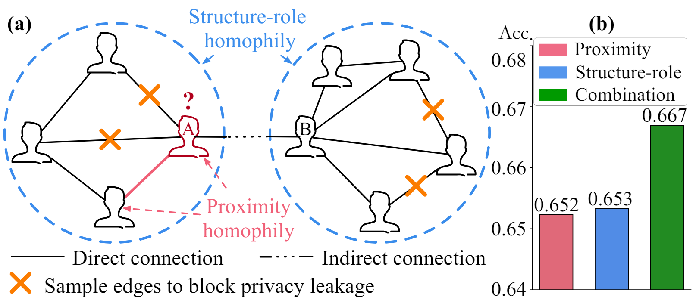
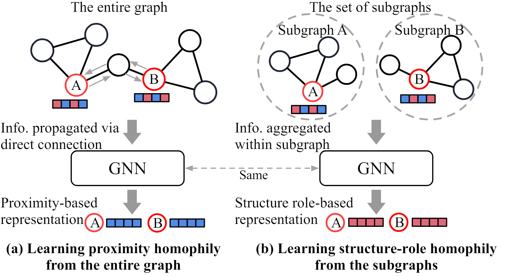
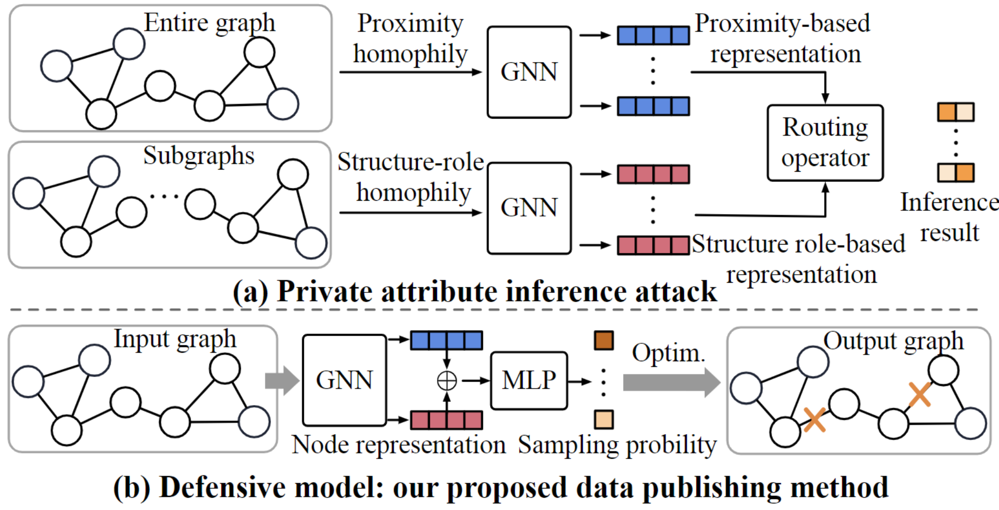

# <center> Unveiling Privacy Vulnerabilities: Investigating the Role of Structure in Graph Data (KDD'24) </center>

<div align='center'>

Hanyuan Yuan, <a href='https://galina0217.github.io/'>Jiarong Xu*</a>, <a href='https://en.gsm.pku.edu.cn/faculty/wangcong/'>Cong Wang</a>, <a href='https://yziqi.github.io/'>Ziqi Yang</a>, Chunping Wang, Keting Yin and <a href='http://yangy.org/'>Yang Yang</a>. (*Corresponding author)


 <a href='https://kdd2024.kdd.org/'></a> 
 <a href='https://github.com/horrible-dong/DNRT/blob/main/LICENSE'></a> 



</div>

## Brief Introduction

The public sharing of user information opens the door for adversaries to infer private data, leading to privacy breaches. 
While studies have concentrated on privacy leakage via public user attributes, the threats associated with user relationships are often neglected. 
This study aims to advance the understanding of privacy risks emanating from network structure, moving beyond direct neighbor connections to the broader implications of indirect network structural patterns.

- **Problem and measure**: Our work pioneers a comprehensive investigation into the problem of Graph Privacy leakage via 
  Structure (**GPS**), introducing the innovative Generalized Homophily Ratio (**GHRatio**) as a measure of privacy leakage. 
- **Attack model**: We introduce a novel private attribute inference attack leveraging a data-centric strategy to exploit all identified 
  privacy breaches. By feeding a GNN various data forms, it gains the ability to learn from multiple homophily types
  that result in privacy risks. 
- **Defensive model**: To counter the attacks, we propose a graph data publishing method that employs learnable graph sampling, rendering the 
  sampled graph suitable for publication.

For more details, please refer to the paper.


## Table of Contents:

* <a href='#Environment Set-up'>Environment Set-up </a>
* <a href='#Dataset Set-up'>Dataset Set-up </a>
* <a href='#Attribute inference'>Experiment on graph private attribute inference attack </a>
* <a href='#Graph publishing'>Experiment on privacy-preserving graph data publishing </a>


### Environment Set-up
<span id='Environment Set-up'/></span>

Please first clone the repo and install the required environment, which can be done by running the following commands:

```shell
conda create -n gps python=3.8.0 -y
conda activate gps
# Torch 2.0.1 with CUDA 11.8
pip install torch==2.0.1 torchvision==0.15.2 torchaudio==2.0.2 --index-url https://download.pytorch.org/whl/cu118
# Install required libraries
pip install -r requirements.txt
pip install torch-sparse==0.6.17 -f https://pytorch-geometric.com/whl/torch-2.0.1+cu118.html
pip install torch-scatter==2.1.1 -f https://pytorch-geometric.com/whl/torch-2.0.1+cu118.html
# Clone our repo
git clone https://github.com/xxx08796/GPS_KDD.git
cd GPS_KDD
mkdir dataset
```


### Dataset Set-up
<span id='Dataset Set-up'/></span>

We used three datasets in this work, including: **Pokec-z**, **Pokec-n**, and **NBA**, you can download the [pokec/]() 
and [NBA/]() directory [here](https://github.com/EnyanDai/FairGNN/tree/main/dataset).
And add them to [./dataset/]() in this project. Specifically:

- `NBA`: [./dataset/nba_sub/raw/nba.csv](), [./dataset/nba_sub/raw/nba_relationship.txt]().
- `Pokec-n`: [./dataset/pokec_sub/raw/region_job_2.csv](), [./dataset/nba_sub/raw/region_job_2_relationship.txt]().
- `Pokec-z`: [./dataset/pokec_sub/raw/region_job.csv](), [./dataset/nba_sub/raw/region_job_relationship.txt]().


### Experiment on graph private attribute inference attack
<span id='Attribute inference'/><span>

- Our proposed graph private attribute inference attack is based on a data-centric strategy of feeding different data 
forms (i.e., graph vs subgraphs) into GNN  to learn different knowledge (i.e., proximity homophily vs structure-role homophily).

<div align='center'>

</div>


- **Launching an attack:** To run the proposed graph private attribute attack, you could execute [exp_attack.py](exp_attack.py). 

```text
python exp_attack.py \
    --device <GPU ID> \
    --num_layers <GNN layers> \
    --train_ratio <training data ratio> \
    --p_encoder <GNN encoder for proximity homophily> \
    --s_encoder <GNN encoder for structure-role homophily> \
    --num_workers <dataloader workers> \
    --dataset < dataset name> \
    --sens_attr <private attribute>
```

- Below is a demo on **NBA**, treating **country** as the private attribute:
```shell
python exp_attack.py --device 0 --num_layers 2 --train_ratio 0.1 --p_encoder P_GIN --s_encoder S_GIN --num_workers 1 --dataset nba --sens_attr country
```


## Experiment on privacy-preserving graph data publishing
<span id='Graph publishing'/><span>


- The proposed method for graph data publishing is based on adversarial training strategy, where the objectives 
  are (1) defending against worst-case attack, (2) limiting benefits that graph structure provides for attribute inference,
  and (3) controlling the deviation of the sampled graph.

<div align='center'>

</div>

- To learn the sampled graph and test the performance of privacy-preserving and utility, you could execute [exp_defense.py](exp_defense.py). 
  
```text
python exp_defense.py \
    --device <GPU ID>
    --num_layers <GNN layers>
    --train_ratio <training data ratio>
    --p_encoder <GNN encoder for proximity homophily>
    --s_encoder <GNN encoder for structure-role homophily>
    --num_workers <dataloader workers>
    --dataset <dataset name>
    --sens_attr <private attribute>
    --ds_label <downstream label>
    --lam <hyper-param>
    --gamma <hyper-param>
    --eta <hyper-param>
```

- Below is a demo on **NBA**, treating **country** as the private attribute and **salary** as the downstream label:
```shell
python exp_defense.py --device 0 --num_layers 2 --train_ratio 0.1 --p_encoder P_GIN --s_encoder S_GIN --num_workers 1 --dataset nba --sens_attr country --ds_label SALARY --lam 2.0 --gamma 3.0 --eta 2.0
```
---------

## Contact

For any questions or feedback, feel free to contact [Hanyang Yuan](mailto:yuanhy0408@zju.edu.cn).

## Citation

If you find our work useful in your research or applications, please kindly cite:

```tex
@inproceedings{yuan2024unveiling,
title={Unveiling Privacy Vulnerabilities: Investigating the Role of Structure in Graph Data}, 
author={Hanyang Yuan and Jiarong Xu and Cong Wang and Ziqi Yang and Chunping Wang and Keting Yin and Yang Yang},
year={2024},
booktitle={Proceedings of the 30th ACM SIGKDD Conference on Knowledge Discovery and Data Mining},
}
```

## Acknowledgements

This code implementation was inspired by [GraphGPS](https://github.com/rampasek/GraphGPS) and [ADGCL](https://github.com/susheels/adgcl). 
This readme.md was inspired by [GraphGPT](https://github.com/HKUDS/GraphGPT). Thanks for their wonderful works.


